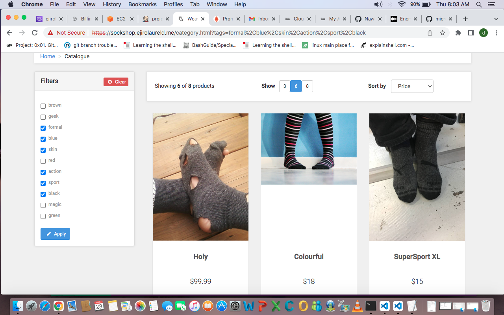

# cicd-kubernetes-project

- I built the environment needed for this project on AWS using Terraform.
- I explored learning Jenkins and Github-actions as my tool for continuous integration and deployment but i used Jenkins for this project.
- I depoyed my portoflio app, sock-shock app with cart logging, and set up monitoring and alerting using prometheus and grafana with cloud watch as my logging tool. 
- I used nginx ingress controller for the networking creating one load balancer for all my apps
- I also attempted to set up Honeycomb.io for traces, everything needed for observability(metrics, logs and trace).

- I got a certificate from letsencrypt using Kubernetes certificate manager and used nginx controller to route traffic from the network load balancer created in the cluster to route 53
- 
- Below are url of the apps deployed  

- [Portfolio](https://portfolio.ejirolaureld.me)
- [Sockshop](https://sockshop.ejirolaureld.me)
- [Prometheus](https://prometheus.ejirolaureld.me)
- [Grafana](https://grafana.ejirolaureld.me)

  
  
  
  
  
  
