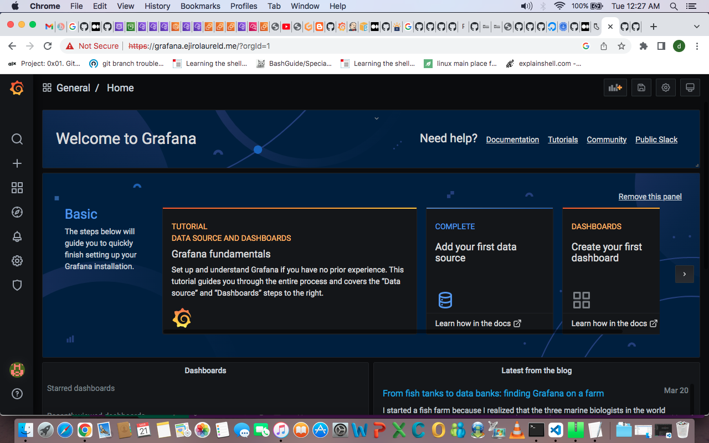

# cicd-iaac-kubernetes-project

## Project Instructions

### Everything needs to be deployed using Infrastructure as a code approach
- Deploy a microservice based architecture on Kubernetes and create a clear Iaac deployment 
- Deploy a web app of your choosing with nginx/httpd frontend proxy and a database (mongo,postresgl etc) backend.
- Provision the Socks Shop example microservice application https://github.com/microservices-demo/microservices-demo
- Emphasize readability, maintainability and Devops methodologies. 

# My solution summary
- I built the environment needed for this project on Amazon Cloud using Terraform.
- I explored learning Jenkins and Github-actions as my tool for continuous integration and deployment but I used Jenkins for this project.
- I depoyed my portoflio app, sock-shock app with cart logging, and set up monitoring and alerting using prometheus and grafana with cloud watch as my logging tool. 
- I used Nginx Ingress Controller for the networking creating a proxy with one Load balancer for all the apps deployed in my cluster, thereby reducing deployment cost.
- An Ingress controller is a specialized load balancer for Kubernetes (and other containerized) environments. With NGINX Ingress Controller you harness Kubernetes         networking on Layers 4 through 7, to enable tighter security and traffic control among Kubernetes services.

- I also attempted to set up Honeycomb.io for traces, everything needed for observability(metrics, logs and trace).

- I got a letsencrypt acme certificate using Kubernetes certificate manager and used nginx controller to route traffic from the network load balancer created in the cluster to route 53.
- 
- I deployed my apps to the cluster provisoned using the Jenkins pipeline script.
- Below are url of the apps deployed  

- [Portfolio](https://portfolio.ejirolaureld.me)
- [Sockshop](https://sockshop.ejirolaureld.me)
- [Prometheus](https://prometheus.ejirolaureld.me)
- [Grafana](https://grafana.ejirolaureld.me)

  
  
  
  
  
  
